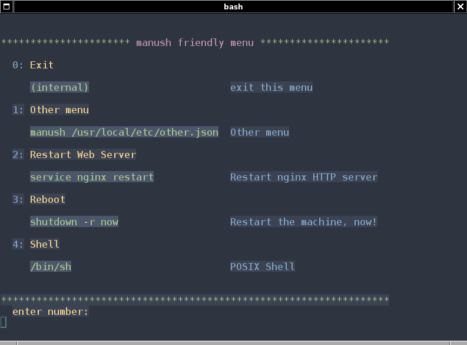

manush is a simple menu shell.

it presents the list of configurable options to the user.  
each option represents a command to run.  

those options are described in a configuration file.

configuration
=============

manush needs to be started with exactly one commandline argument: path to the configuration file. in case no configuration file is provided, the default `/usr/local/etc/manush.json` will be used. if it's not found too, then the program will issue an error and exit.

manush will attempt to validate the configuratin file with `jq`. that is the inly runtime dependency it currently has.

the example configuration file `manush.json` can be found in the template directory.

it looks like this:

```
{
  "Top":
      {
        "name": "Top",
	"exec": "top",
	"cmnt": "top utility"
      },
  "Ls":
      {
        "name": "List",
	"exec": "ls -al",
	"cmnt": "list files and directories"
      },
  "sh":
    {
      "name": "shell",
      "exec": "/bin/sh",
      "cmnt": "posix shell"
    }
}

```

manush will add one, first option to the list of options described in the configuration: `exit`.

pro tip: you can have `manush /path/to/other_configuration_file.json` as one of the options. thus you may create menus with unlimited depth! (:

install
============

there are two ways to build manush.

first is by using vipack package manager.

therefore, the prerequisites are : voc (vishap oberon compiler) and vipack (vishap package manager).

just issue the following in this directory:

```
vipack -t `pwd`/deptree -p manush -P `pwd`
```

vipack should download all the necessary dependencies and build manush.

then you will find the resulting binary in `build` directory.

second way to build manush is by using the supplied makefile.

